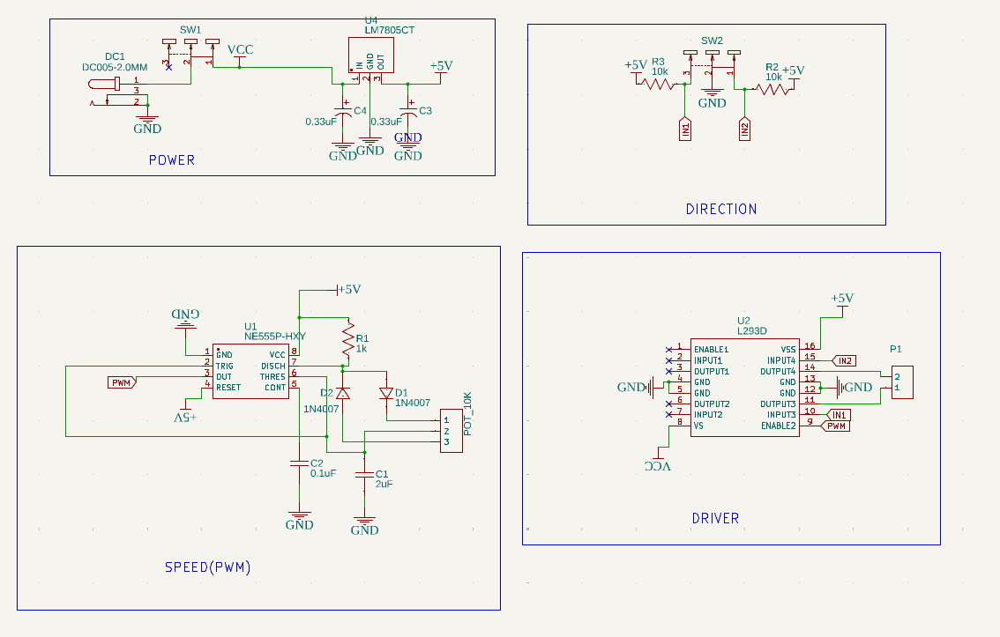
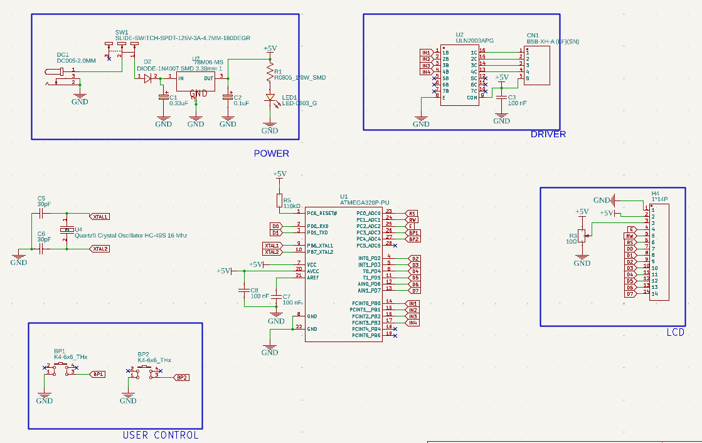

# Rotating Jewelry Display Platform

A motorized rotating display platform built for a **minimalist circuit design competition**. The project was implemented in two versions — one using only analog components (no MCU), and one using an ATmega8 microcontroller — to explore the trade-offs between simplicity and functionality.

---

## Versions

### Version 1 — 555 Timer (No MCU)
A purely analog solution using a **555 timer IC** in astable mode to generate a PWM signal for motor speed control.

**Features:**
- PWM-based motor speed control via adjustable duty cycle
- Clockwise/counterclockwise direction control via slide switch
- No microcontroller — minimal components, low cost

**How it works:**
- The 555 timer generates a continuous square wave with a variable duty cycle
- Duty cycle is adjusted by tuning resistors and capacitors in the astable circuit
- The PWM signal controls average voltage to the motor, regulating rotation speed
- A slide switch selects the direction of rotation

---

### Version 2 — ATmega8 (MCU-based)
An enhanced version adding precise stepper motor control and a pricing display system via microcontroller.

**Features:**
- Stepper motor with adjustable speed and direction
- 16x2 LCD displaying current jewelry price
- Two buttons to increment/decrement the displayed price in real time

**How it works:**
- The ATmega8 processes button inputs and updates the LCD price accordingly
- Stepper motor is driven with precise timing signals from the MCU
- DC power supply powers the motor, MCU, and LCD

---

## Hardware Summary

| Component | 555 Version | ATmega8 Version |
|---|---|---|
| Motor control | 555 timer + PWM | ATmega8 + stepper driver |
| Speed control | Analog (RC circuit) | Digital (MCU timing) |
| Direction control | Slide switch | Configurable via MCU |
| Display | None | 16x2 LCD |
| Price input | None | Push buttons |

---

## Development Environment
- **ATmega8 version:** Atmel Studio / AVR-GCC
- **555 version:** Analog circuit, no software

---

## Project Context
Built for the **Gaussian Peak** minimalist circuit design competition at USTHB.
